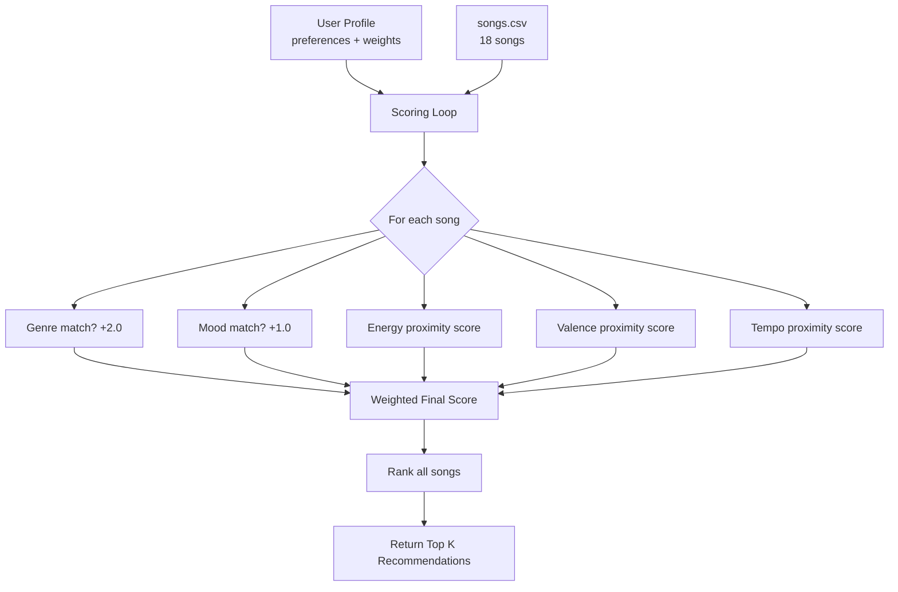

# 🎵 Music Recommender Simulation

## Project Summary

In this project you will build and explain a small music recommender system.

Your goal is to:

- Represent songs and a user "taste profile" as data
- Design a scoring rule that turns that data into recommendations
- Evaluate what your system gets right and wrong
- Reflect on how this mirrors real world AI recommenders

Replace this paragraph with your own summary of what your version does.

---

## How The System Works

Platforms such as Spotify and TikTok use a combination of analyzing patterns across users all around the world and aligning song data with what a user normally likes to listen to and watch. In short, it is a combination between collaborative filtering and context-based filtering. This system only focusses on the song itself, and compares it with what you like. In other words, it only takes into consideration, your likes, dislikes, and preferences. It doesn't account for what the million other users around the world like listenting to. 

## Song Features

Genre: The song's musical category (jazz, rock, pop, etc.)
Mood: The emotional vibe of the song (happy, sad, chill, agressive)
Energy: How energetic the musicality feels (0 to 1)
Valence: How positive and upbeat a song sounds (0 to 1)
Tempo BPM: Beats per minute (e.g. 80, 135)
Danceability: How fitting the song is for dancing (0 to 1)
Acousticness: How electric vs. acoustic (0 to 1)

## User Profile
- Preferred mood and genre
- Preferred numerical values for the song features (genre, mood, energy, etc.)
- Weightage of each feature that matters for the user the most

## Scoring and Ranking
The recommender scores each song by comparing the features it has and the user's preferences. Numerical features are scored based on proximity. This means that songs that are closer to the user's preferred value score higher. Mood and genre matches give a bonus. Every feature score is multiplied by its weight and finally summed into a relevance score between 0.0 and 1.0. Then, songs are ranked highest to lowest and the best song matches are recommended to the user.

## Algorithm Recipe
1. +2.0 points if the song's genre matches the user's favorite music genre
2. +1.0 point if the song's mood matches the user's favorite mood
3. Proximity score for energy: 1 - abs(song.energy - targert_energy)
4. Proximity score for valence: 1 - abs(song.valence - target_valence)
5. Proximity score for tempo: 1 - abs(song.tempo - target_tempo) / 150
6. All scores multiplied by their feature weights and summed

## Potential Biases:
1. Genre Bias: System cares too much about the genre, so a perfect song might get dismissed solely because it's not the correct genre
2. Small Dataset: Only 18 songs in the dataset implies that the same exact songs get re-shuffled as recommendations
3. Mood Labels: "Chill" and "Relaxed" basically mean the same thing but the system interprets them as two completely different things. 

### Data Flow



---

## Getting Started

### Setup

1. Create a virtual environment (optional but recommended):

   ```bash
   python -m venv .venv
   source .venv/bin/activate      # Mac or Linux
   .venv\Scripts\activate         # Windows

2. Install dependencies

```bash
pip install -r requirements.txt
```

3. Run the app:

```bash
python -m src.main
```

### Running Tests

Run the starter tests with:

```bash
pytest
```

You can add more tests in `tests/test_recommender.py`.

---

## Experiments You Tried

Use this section to document the experiments you ran. For example:

- What happened when you changed the weight on genre from 2.0 to 0.5
- What happened when you added tempo or valence to the score
- How did your system behave for different types of users

---

## Limitations and Risks

Summarize some limitations of your recommender.

Examples:

- It only works on a tiny catalog
- It does not understand lyrics or language
- It might over favor one genre or mood

You will go deeper on this in your model card.

---

## Reflection

Read and complete `model_card.md`:

[**Model Card**](model_card.md)

Write 1 to 2 paragraphs here about what you learned:

- about how recommenders turn data into predictions
- about where bias or unfairness could show up in systems like this


---

## 7. `model_card_template.md`

Combines reflection and model card framing from the Module 3 guidance. :contentReference[oaicite:2]{index=2}  

```markdown
# 🎧 Model Card - Music Recommender Simulation

## 1. Model Name

Give your recommender a name, for example:

> VibeFinder 1.0

---

## 2. Intended Use

- What is this system trying to do
- Who is it for

Example:

> This model suggests 3 to 5 songs from a small catalog based on a user's preferred genre, mood, and energy level. It is for classroom exploration only, not for real users.

---

## 3. How It Works (Short Explanation)

Describe your scoring logic in plain language.

- What features of each song does it consider
- What information about the user does it use
- How does it turn those into a number

Try to avoid code in this section, treat it like an explanation to a non programmer.

---

## 4. Data

Describe your dataset.

- How many songs are in `data/songs.csv`
- Did you add or remove any songs
- What kinds of genres or moods are represented
- Whose taste does this data mostly reflect

---

## 5. Strengths

Where does your recommender work well

You can think about:
- Situations where the top results "felt right"
- Particular user profiles it served well
- Simplicity or transparency benefits

---

## 6. Limitations and Bias

Where does your recommender struggle

Some prompts:
- Does it ignore some genres or moods
- Does it treat all users as if they have the same taste shape
- Is it biased toward high energy or one genre by default
- How could this be unfair if used in a real product

---

## 7. Evaluation

How did you check your system

Examples:
- You tried multiple user profiles and wrote down whether the results matched your expectations
- You compared your simulation to what a real app like Spotify or YouTube tends to recommend
- You wrote tests for your scoring logic

You do not need a numeric metric, but if you used one, explain what it measures.

---

## 8. Future Work

If you had more time, how would you improve this recommender

Examples:

- Add support for multiple users and "group vibe" recommendations
- Balance diversity of songs instead of always picking the closest match
- Use more features, like tempo ranges or lyric themes

---

## 9. Personal Reflection

A few sentences about what you learned:

- What surprised you about how your system behaved
- How did building this change how you think about real music recommenders
- Where do you think human judgment still matters, even if the model seems "smart"

